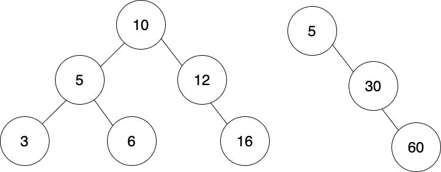
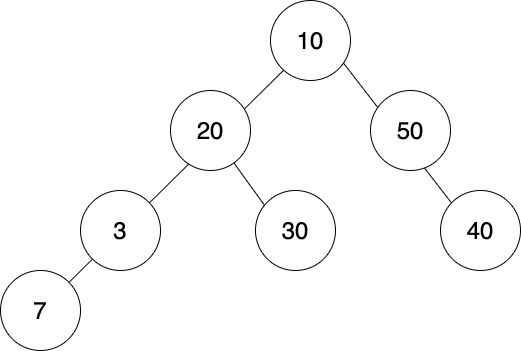

# Days 1 to 2: Level-Order aka Breadth-First Tree Traversal

**Fork and then clone me!**



There are a number of different ways to traverse a tree, or in other words, travel down a tree from its root node all the way through to its leaf nodes or to a target node. Today we'll be focusing on a type of traversal called level-order or breadth-first tree traversal, which can be used with any type of tree data structure.

## What is level-order tree traversal?

With level-order traversal we start at the root and then move down the tree one level, or layer, at a time. You can think of it as being similar to a printer: it outputs its ink in rows until the image is complete. You can also think of it as being similar to typing a document: you type one line going from left to right, and then move down to the next and repeat.

Take a moment to look at the trees at the top of this README. If we were to perform a level-order traversal of the left tree and print out each value, we would get: 10, 5, 12, 3, 6, 16. For the tree on the right: 5, 30, 60.

## But Why?

Let's say we had our data stored in a tree, but it wasn't a binary search tree (a BST requires its nodes to be ordered). In this tree the values of our nodes can be stored in any order:



Now, let's say we want to find the shortest path to the node with a value of 30. That node could be anywhere! On the left side or the right side. If we do a level-order traversal (breadth-first search aka BFS), we can stop searching once we reach the correct depth. In contrast, if we were to go all the way down one path, before coming back up to the root and going down a different path, we could end up going much further down the tree than we need to.

There are other uses for a level-order tree traversal, but we'll let you research that when you're ready to do so.

## Perform a Level-Order Tree Traversal

For this challenge, we're going to write a method that takes the root node of a tree, performs a level-order traversal, and returns an array representing each layer of the tree. The array will contain the values of the nodes, rather than the nodes themselves:

```
    1
  /   \
 2     3

level_order_traversal(root)
=> [[1], [2, 3]]
```

```
       10
      /  \
    20    30
   /  \
  9   22

level_order_traversal(root)
=> [[10], [20, 30], [9, 22]]
```

Note that this challenge can be completed iteratively or recursively at roughly the same difficulty level.

Use the language of your choosing. We've included starter files for some languages where you can pseudocode, explain your solution and code.

## Before you start coding:

1. Rewrite the problem in your own words
2. Validate that you understand the problem
3. Write your own test cases
4. Pseudocode
5. Code!

**_And remember, don't run our tests until you've passed your own!_**

## How to run your own tests

### Ruby

1. `cd` into the ruby folder
2. `ruby <filename>.rb`

### JavaScript

1. `cd` into the javascript folder
2. `node <filename>.js`

## How to run our tests

### Ruby

1. `cd` into the ruby folder
2. `bundle install`
3. `rspec`

### JavaScript

1. `cd` into the javascript folder
2. `npm i`
3. `npm test`
